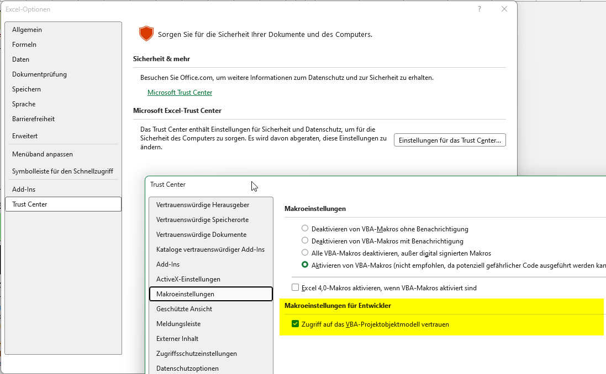

# Info

Excel-Tabelle als Korrekturhilfe des bayerischen Mathe-Abis.

- Einfaches Anlegen der Korrekturtabellen
- Konfigurationsseite für Schülernamen und Aufgaben
- Automatische Auswertung
- Wahlaufgaben (ab 2026) konfigurierbar
- Export der Ergebnisse als druckfertiges PDF
- Notenschlüssel auf eigenem Tab hinterlegt

## EXCEL Einstellunge

- In der aktuellen Version muss der Zugriff auf das VBA-Projektmodell aktiviert sein. Dazu in Excel auf "Datei" -> "Optionen" -> "Trust Center" -> "Einstellungen für das Trust Center" -> "Makroeinstellungen" -> "Zugriff auf das VBA-Projektmodell vertrauen" aktivieren.

## 💖 Help Me Keep This Project Going

Maintaining and improving this project takes time, energy, and resources. If you like the idea and want to see the project progressing and released, consider supporting its development! Ideally you're a frontend (react) or backend (python) dev and you're in need of a tool like this!

## 🙌 Ways You Can Help

- **Contribute** – Are you a frontend or backend developer? Let me know if you want to contribute!
- **Share the project** – Spread the word!
- **Open issues** – Found a bug or have a feature suggestion? Open an issue and let me know!
- **Support financially** – If you’d like to support this work directly, consider:

  - ❤️ [Sponsor me on GitHub](https://github.com/sponsors/bee-eater)
  - 🧡 [Donate via PayPal](https://www.paypal.com/donate/?hosted_button_id=MUS7QJU8YB9CY)

Your support makes a real difference — thank you!
